<!-- ═══════════════════════════════════════════════════════════════════
      YOGVID.OS  ·  profile README  ·  github.com/yogvidwankhede
      This is not a static page. Boot it. Talk to it. Explore it.
     ═══════════════════════════════════════════════════════════════════ -->

<div align="center">

<!-- ░░ ANIMATED HERO (custom self-hosted SVG) ░░ -->
<a href="https://yogvidwankhede.github.io/yogvidwankhede/">
  
</a>

<!-- ░░ LIVE TYPING LINE ░░ -->
<a href="https://yogvidwankhede.github.io/yogvidwankhede/">
  
</a>

<br/>

<!-- ░░ PRIMARY CTA — the experience ░░ -->
<a href="https://yogvidwankhede.github.io/yogvidwankhede/">
  
</a>
&nbsp;
<a href="https://yogvidwankhede.github.io/yogvidwankhede/#terminal">
  
</a>

<br/><br/>

<!-- ░░ SOCIALS ░░ -->
<a href="https://www.linkedin.com/in/yogvid-wankhede-149103231/"></a>
<a href="mailto:yogvidwankhede@gmail.com"></a>
<a href="https://www.yogvidwankhede.com"></a>
<a href="https://huggingface.co/yogvidwankhede"></a>
&nbsp;


</div>

---

<!-- ═══════════════════════════════ BOOT LOG ═══════════════════════════════ -->

```yaml
visitor@yogvid.os:~$ whoami --verbose

  name:      Yogvid Wankhede
  status:    ● open_to_opportunities  (AI / Full-Stack / ML · 2026)
  now:       Software Engineering Intern @ EUNO — production LLM agents
  studying:  M.S. Data Analytics & Statistics @ Washington University in St. Louis
  certified: Anthropic — AI Fluency + Claude 101
  mission:   build systems that think, ship, and feel alive
  location:  St. Louis, MO · response_time < 24h
```

> [!NOTE]
> **This profile has a second layer.** The banner links to a fully interactive
> experience — cinematic boot sequence, an **AI agent you can chat with**, a
> **3D project gallery**, and a hidden mini-game. → **[the live experience](https://yogvidwankhede.github.io/yogvidwankhede/)**

---

## 🧠  `~/what-i-build`

<table>
<tr>
<td width="33%" valign="top">

**AI Engineering**
<br/><sub>LLM agent systems that run in production.</sub>

`Claude API` `LangGraph`
`RAG` `Agent Orchestration`
`Evals` `Prompt Engineering`

</td>
<td width="33%" valign="top">

**Full-Stack**
<br/><sub>From data layer to the interface people touch.</sub>

`TypeScript` `NestJS`
`React` `Python` `Flask`
`PostgreSQL` `MongoDB`

</td>
<td width="33%" valign="top">

**ML Research**
<br/><sub>Published work that moves the metric.</sub>

`PyTorch` `TensorFlow`
`Computer Vision` `NLP`
`Signal Processing`

</td>
</tr>
</table>

---

## 🚀  `~/selected-work`

<table>
<tr>
<td width="50%" valign="top">

### 🫀 EMMI · 3D Cardiac Imaging
Noninvasive uterine-contraction mapping fusing MRI geometry with 256-channel recordings. Solved the inverse problem with the **Method of Fundamental Solutions**.

`Inverse ECG` `MFS` `MRI` `Signal Proc.`

**↑ correlation 0.85 → 0.92 · ↓ compute 40% · 118 episodes**

<sub>Research @ WashU School of Medicine</sub>

</td>
<td width="50%" valign="top">

### ✋ Real-Time Sign Language Interpreter
MediaPipe + **Dynamic Time Warping** + NLP recognizing sign language live — beating an LSTM baseline by 11.7%. **Published in Springer Nature.**

`MediaPipe` `DTW` `NLP` `Python`

**92% accuracy · <200ms latency · 500+ req/day**

[`code →`](https://github.com/yogvidwankhede/Sign_Language_Interpreter) · [`paper →`](https://link.springer.com/chapter/10.1007/978-981-97-1488-9_7)

</td>
</tr>
<tr>
<td width="50%" valign="top">

### ⚕️ HealthMate-AI
RAG medical assistant grounded in **40K+ text chunks**, with a fine-tuned domain-adapted embedding model shipped to **Hugging Face**.

`RAG` `LoRA` `Pinecone` `GPT-4o` `Mistral`

**93.3% retrieval · +18.3% Spearman · 3-fold CV**

[`code →`](https://github.com/yogvidwankhede/HealthMate-AI) · [`model →`](https://huggingface.co/yogvidwankhede/healthmate-minilm-l6-v2-medical-3fold)

</td>
<td width="50%" valign="top">

### 👁️ Image Captioning + TTS
InceptionV3 + Transformer captioning with text-to-speech — giving visual scenes a **voice** for accessibility.

`InceptionV3` `Transformer` `MS COCO` `Docker`

**+16% precision · <300ms inference · 330K+ samples**

[`code →`](https://github.com/yogvidwankhede/Image-Captioning-System-Enhanced-with-a-TTS)

</td>
</tr>
</table>

---

## 📊  `~/live-metrics`

<div align="center">


</div>

<!-- ░░ CONTRIBUTION SNAKE (populated by GitHub Action — see setup guide) ░░ -->
<div align="center">
  <picture>
    <source media="(prefers-color-scheme: dark)" srcset="https://raw.githubusercontent.com/yogvidwankhede/yogvidwankhede/output/snake-dark.svg" />
    
  </picture>
</div>

---

## 🧭  `~/trajectory`

```
● 2026 ──  SWE Intern @ EUNO ............ 6-stage LLM pipeline · ~98% valid output · −40% cost
│ 2026 ──  Research Asst @ WashU Med ..... EMMI · inverse imaging · 0.85→0.92 correlation
│ 2025 ──  Teaching Asst @ WashU ......... circuits · 40+ students · SPICE + hardware labs
│ 2024 ──  Data Science Intern @ ASTERISC  cyber-attack forecasting · 95.4% · published (IJSRD)
○ 2024 ──  M.S. Data Analytics @ WashU ... + B.Tech Artificial Intelligence
```

---

<!-- ═══════════════════════════ EASTER EGGS ═══════════════════════════ -->

<details>
<summary><b>◇ decrypt <code>.secrets/</code></b> &nbsp;<sub>(you found the hidden layer)</sub></summary>

<br/>

```bash
visitor@yogvid.os:~$ cat .secrets/README

  🎮  the live site hides a mini-game — TOKEN CATCH.
      launch it with the Konami code:  ↑ ↑ ↓ ↓ ← → ← → B A
      ...or just type `game` into the AI terminal.

  🕶️  type `matrix` in the terminal. trust me.

  🔓  type `sudo hire-yogvid` for a slightly biased recommendation.

  ☕  fun fact: I once cut inverse-ECG compute 40% while IMPROVING accuracy.
      free lunch exists — occasionally.
```

</details>

<details>
<summary><b>🛠️ how this profile was built</b></summary>

<br/>

- **Header** — a hand-authored animated **SVG** (`assets/hero-banner.svg`): SMIL-animated neural mesh, gradient nameplate, cycling role text. No image editor, just math.
- **Experience site** — a single self-contained `index.html`: canvas neural background, a scripted **AI agent terminal**, a 3D-tilt project gallery, a canvas mini-game, Konami + matrix easter eggs. Vanilla JS, `prefers-reduced-motion` aware, keyboard accessible.
- **Stats** — github-readme-stats + streak + snake action, themed to `YOGVID.OS`.
- **Philosophy** — a profile should be an *experience*, not a page.

</details>

---

<div align="center">

### `let's build something worth remembering.`

<a href="mailto:yogvidwankhede@gmail.com"></a>

<sub>© 2026 Yogvid Wankhede · <i>built as an experience, not a page</i> · <code>YOGVID.OS v2.6</code></sub>

</div>
